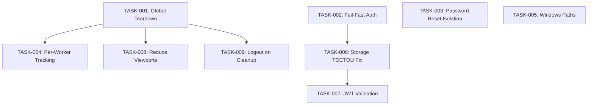

# Task Assignments: E2E Test Architecture Fixes
Generated: 2026-01-09
PRD Reference: `prd-e2e-test-architecture-fixes.md`

## Overview

This file contains the task breakdown for implementing E2E test architecture fixes identified by the expert panel. Tasks are organized by priority (P0 > P1 > P2) and include dependency information for proper execution ordering.

## Summary

| Metric | Value |
|--------|-------|
| Total Tasks | 9 |
| Total Effort | 14.5 hours |
| Duration | 7 days (1 sprint) |
| Critical Path | TASK-001 > TASK-004 > TASK-007 |

## Task Assignment Table

| Task ID | Description | Type | Assigned Sub-Agent | Dependencies | Effort | Status | Priority |
|---------|-------------|------|-------------------|--------------|--------|--------|----------|
| TASK-001 | Implement Global Teardown via Project Dependencies | Configuration | DevOps | None | 2 hours | To Do | P0 |
| TASK-002 | Fix Silent Auth Fixture Failures | Bug Fix | Frontend | None | 30 min | To Do | P0 |
| TASK-003 | Isolate Password Reset Tests | Bug Fix | QA | None | 1 hour | To Do | P0 |
| TASK-004 | Implement Per-Worker Resource Tracking | Refactor | QA | TASK-001 | 4 hours | To Do | P1 |
| TASK-005 | Fix Windows Binary Path Resolution | Bug Fix | DevOps | None | 1 hour | To Do | P1 |
| TASK-006 | Fix Storage State TOCTOU Race Condition | Bug Fix | QA | TASK-002 | 2 hours | To Do | P1 |
| TASK-007 | Add JWT Expiry Validation | Enhancement | Frontend | TASK-006 | 2 hours | To Do | P2 |
| TASK-008 | Reduce Viewport Projects for CI | Enhancement | DevOps | TASK-001 | 1 hour | To Do | P2 |
| TASK-009 | Add Logout on Cleanup | Enhancement | QA | TASK-001 | 1 hour | To Do | P2 |

## Dependency Graph

## Critical Path Analysis

**Longest Path**: TASK-001 (2h) > TASK-004 (4h) > TASK-007 (depends via TASK-006) = 8+ hours

**Parallel Execution Opportunities**:
- TASK-001, TASK-002, TASK-003, TASK-005 can all start immediately (no dependencies)
- After TASK-001 completes: TASK-004, TASK-008, TASK-009 can run in parallel
- After TASK-002 completes: TASK-006 can start

## Detailed Task Cards

### TASK-001: Implement Global Teardown via Project Dependencies

**Priority**: P0 - CRITICAL
**Type**: Configuration
**Effort**: 2 hours
**Assigned**: DevOps
**Dependencies**: None

**Files to Create**:
- `quikadmin-web/e2e/global.setup.ts`
- `quikadmin-web/e2e/global.teardown.ts`

**Files to Modify**:
- `quikadmin-web/playwright.config.ts`

**Acceptance Criteria**:
- [ ] Setup project runs before all test projects
- [ ] Cleanup project runs after all test projects complete
- [ ] `globalCleanup()` function is called and completes successfully
- [ ] Auth states are cleared after test run

---

### TASK-002: Fix Silent Auth Fixture Failures

**Priority**: P0 - CRITICAL
**Type**: Bug Fix
**Effort**: 30 minutes
**Assigned**: Frontend
**Dependencies**: None

**Files to Modify**:
- `quikadmin-web/e2e/fixtures/auth.fixture.ts`

**Acceptance Criteria**:
- [ ] `authenticateUser()` throws on failure instead of returning null
- [ ] Error messages include user email
- [ ] Error messages include troubleshooting hints
- [ ] All fixture usages handle thrown errors (no null checks needed)

---

### TASK-003: Isolate Password Reset Tests

**Priority**: P0 - CRITICAL
**Type**: Bug Fix
**Effort**: 1 hour
**Assigned**: QA
**Dependencies**: None

**Files to Create**:
- `quikadmin-web/e2e/helpers/supabase.helper.ts`

**Files to Modify**:
- `quikadmin-web/e2e/tests/auth/login.spec.ts`

**Environment Requirements**:
- `SUPABASE_SERVICE_ROLE_KEY` must be set in environment

**Acceptance Criteria**:
- [ ] Password is restored after each password reset test
- [ ] Subsequent test runs don't fail due to changed passwords
- [ ] Supabase helper is properly initialized with service role key

---

### TASK-004: Implement Per-Worker Resource Tracking

**Priority**: P1 - HIGH
**Type**: Refactor
**Effort**: 4 hours
**Assigned**: QA
**Dependencies**: TASK-001

**Files to Modify**:
- `quikadmin-web/e2e/fixtures/org.fixture.ts`

**Acceptance Criteria**:
- [ ] No global arrays for resource tracking
- [ ] Each worker has isolated resource lists
- [ ] Worker cleanup logs include worker index
- [ ] Parallel test runs don't interfere with each other

---

### TASK-005: Fix Windows Binary Path Resolution

**Priority**: P1 - HIGH
**Type**: Bug Fix
**Effort**: 1 hour
**Assigned**: DevOps
**Dependencies**: None

**Files to Modify**:
- `quikadmin-web/scripts/run-e2e-automated.js`

**Acceptance Criteria**:
- [ ] Tests run successfully on Windows
- [ ] Tests run successfully on macOS
- [ ] Tests run successfully on Linux
- [ ] Platform detection is logged for debugging

---

### TASK-006: Fix Storage State TOCTOU Race Condition

**Priority**: P1 - HIGH
**Type**: Bug Fix
**Effort**: 2 hours
**Assigned**: QA
**Dependencies**: TASK-002

**Files to Modify**:
- `quikadmin-web/e2e/fixtures/auth.fixture.ts`

**Acceptance Criteria**:
- [ ] Only one worker creates storage state at a time
- [ ] Stale locks (>60s) are automatically cleaned
- [ ] Workers wait appropriately for lock acquisition
- [ ] No TOCTOU-related failures in parallel runs

---

### TASK-007: Add JWT Expiry Validation

**Priority**: P2 - MEDIUM
**Type**: Enhancement
**Effort**: 2 hours
**Assigned**: Frontend
**Dependencies**: TASK-006

**Files to Modify**:
- `quikadmin-web/e2e/fixtures/auth.fixture.ts`

**Acceptance Criteria**:
- [ ] JWT `exp` claim is decoded and checked
- [ ] Storage state is invalidated before JWT expires (with buffer)
- [ ] Invalid/malformed JWTs don't crash validation
- [ ] Validation reasons are logged

---

### TASK-008: Reduce Viewport Projects for CI

**Priority**: P2 - MEDIUM
**Type**: Enhancement
**Effort**: 1 hour
**Assigned**: DevOps
**Dependencies**: TASK-001

**Files to Modify**:
- `quikadmin-web/playwright.config.ts`

**Acceptance Criteria**:
- [ ] CI runs with 2 viewport projects by default
- [ ] Local dev can run full 5 viewports
- [ ] `FULL_VIEWPORT_MATRIX=true` enables all viewports in CI
- [ ] Test duration reduced by ~60% in CI

---

### TASK-009: Add Logout on Cleanup

**Priority**: P2 - MEDIUM
**Type**: Enhancement
**Effort**: 1 hour
**Assigned**: QA
**Dependencies**: TASK-001

**Files to Modify**:
- `quikadmin-web/e2e/fixtures/auth.fixture.ts`
- `quikadmin-web/e2e/global.teardown.ts`

**Acceptance Criteria**:
- [ ] Logout API called during teardown
- [ ] Sessions properly invalidated
- [ ] Auth state files deleted after logout

---

## Execution Order Recommendation

### Parallel Wave 1 (Day 1-2)
Execute these tasks in parallel as they have no dependencies:
- TASK-002 (Frontend)
- TASK-003 (QA)
- TASK-005 (DevOps)
- TASK-001 (DevOps) - Start, will take longest

### Parallel Wave 2 (Day 3-4)
After Wave 1 completes:
- TASK-006 (QA) - Depends on TASK-002
- TASK-004 (QA) - Depends on TASK-001
- TASK-008 (DevOps) - Depends on TASK-001

### Sequential Wave 3 (Day 5-7)
After Wave 2 completes:
- TASK-007 (Frontend) - Depends on TASK-006
- TASK-009 (QA) - Depends on TASK-001

## Risk Notes

| Task | Risk | Mitigation |
|------|------|------------|
| TASK-003 | Service role key exposure | Document securely in `.env`, never commit |
| TASK-004 | Refactor may break existing tests | Run full test suite after changes |
| TASK-006 | Mutex deadlock | Implement 60s stale lock detection |

---

## Status Legend

| Status | Description |
|--------|-------------|
| To Do | Task not yet started, ready for assignment |
| In Progress | Task currently being worked on |
| Blocked | Task waiting on dependency or external factor |
| Completed | Task finished and verified |

---

**Last Updated**: 2026-01-09
