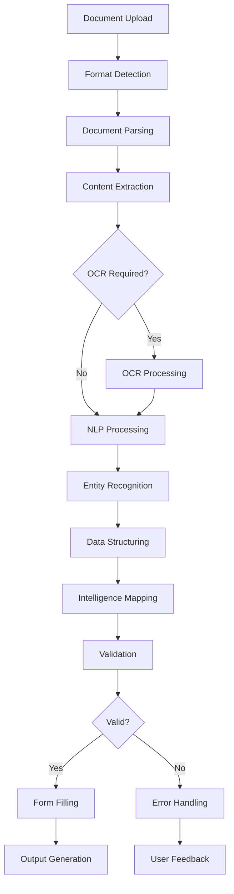

# ⚠️ FUTURE SYSTEM ARCHITECTURE (NOT IMPLEMENTED)

**⚠️ WARNING: This describes FUTURE PLANS, NOT CURRENT IMPLEMENTATION**

**Status:** []()  
**Phase:** Vision (NOT Implemented)

**Current Reality:** See [`../../01-current-state/architecture/system-overview.md`](../../01-current-state/architecture/system-overview.md) for actual architecture.

---

# PDF-Filler Tool - System Architecture

## Executive Summary

This document outlines the comprehensive architecture for a scalable PDF-filler tool that supports multiple input formats, intelligent data extraction, and automated form filling with advanced validation capabilities.

## 1. High-Level Architecture

### Architecture Principles

- **Microservices Architecture**: Loosely coupled, independently deployable services
- **Event-Driven Design**: Asynchronous processing with message queues
- **Domain-Driven Design**: Clear service boundaries based on business domains
- **API-First**: All services expose well-defined APIs
- **Cloud-Native**: Containerized, scalable, and cloud-ready

### System Overview

```
┌─────────────────┐    ┌─────────────────┐    ┌─────────────────┐
│   Client Apps   │────│   API Gateway   │────│ Load Balancer   │
└─────────────────┘    └─────────────────┘    └─────────────────┘
                                │
        ┌───────────────────────┼───────────────────────┐
        │                       │                       │
┌───────▼─────────┐    ┌────────▼────────┐    ┌────────▼────────┐
│ Document Input  │    │  Orchestration  │    │ Form Processing │
│    Service      │    │     Service     │    │     Service     │
└─────────────────┘    └─────────────────┘    └─────────────────┘
        │                       │                       │
┌───────▼─────────┐    ┌────────▼────────┐    ┌────────▼────────┐
│ Data Extraction │    │  Intelligence   │    │   Validation    │
│    Service      │    │     Service     │    │    Service      │
└─────────────────┘    └─────────────────┘    └─────────────────┘
        │                       │                       │
        └───────────────────────┼───────────────────────┘
                                │
                    ┌───────────▼───────────┐
                    │    Storage Layer      │
                    │ - Document Store      │
                    │ - Metadata DB         │
                    │ - Cache Layer         │
                    └───────────────────────┘
```

## 2. Component Architecture

### 2.1 API Gateway

**Responsibilities:**

- Request routing and load balancing
- Authentication and authorization
- Rate limiting and throttling
- Request/response transformation
- API versioning

**Technology Stack:**

- Kong/Envoy Proxy
- JWT authentication
- OAuth 2.0/OpenID Connect

### 2.2 Document Input Service

**Responsibilities:**

- Document upload and validation
- Format detection and classification
- Initial security scanning
- Metadata extraction

**Supported Formats:**

- PDF (all versions)
- DOCX/DOC
- TXT (plain text)
- CSV with custom delimiters

**APIs:**

```yaml
POST /api/v1/documents/upload
POST /api/v1/documents/batch-upload
GET /api/v1/documents/{id}/info
DELETE /api/v1/documents/{id}
```

### 2.3 Data Extraction Service

**Responsibilities:**

- Content parsing by format
- OCR for scanned documents
- Structured data identification
- Entity recognition and classification

**Processing Pipeline:**

1. **Format-Specific Parsing**
   - PDF: Text, tables, forms, images
   - DOCX: Structured content, tables, metadata
   - TXT: Pattern recognition and parsing
   - CSV: Column mapping and data typing

2. **OCR Processing**
   - Tesseract for text recognition
   - Layout analysis for structured data
   - Confidence scoring

3. **NLP Processing**
   - Named Entity Recognition (NER)
   - Key-value pair extraction
   - Semantic relationship mapping

**APIs:**

```yaml
POST /api/v1/extraction/parse
POST /api/v1/extraction/ocr
GET /api/v1/extraction/{job-id}/status
GET /api/v1/extraction/{job-id}/results
```

### 2.4 Intelligence Service

**Responsibilities:**

- Machine learning model management
- Intelligent field mapping
- Pattern recognition and learning
- Confidence scoring and recommendations

**ML Models:**

- **Field Classification Model**: Classifies extracted data types
- **Mapping Prediction Model**: Predicts field mappings
- **Confidence Assessment Model**: Scores mapping confidence
- **Pattern Learning Model**: Learns from user corrections

**APIs:**

```yaml
POST /api/v1/intelligence/map-fields
POST /api/v1/intelligence/train
GET /api/v1/intelligence/models
POST /api/v1/intelligence/predict
```

### 2.5 Form Processing Service

**Responsibilities:**

- PDF form analysis and field detection
- AcroForm and XFA form support
- Form field metadata extraction
- Form filling and generation

**Form Types Supported:**

- **AcroForms**: Standard PDF forms with field objects
- **XFA Forms**: XML Forms Architecture (dynamic forms)
- **Static Forms**: Non-interactive forms requiring overlay

**APIs:**

```yaml
POST /api/v1/forms/analyze
POST /api/v1/forms/fill
GET /api/v1/forms/{id}/fields
POST /api/v1/forms/template/create
```

### 2.6 Validation Service

**Responsibilities:**

- Data type validation
- Business rule validation
- Cross-field validation
- Error reporting and suggestions

**Validation Rules:**

- **Type Validation**: String, number, date, email, phone
- **Format Validation**: Regular expressions, custom patterns
- **Business Rules**: Custom validation logic
- **Cross-Field**: Dependencies and relationships

**APIs:**

```yaml
POST /api/v1/validation/validate
POST /api/v1/validation/rules
GET /api/v1/validation/errors/{job-id}
POST /api/v1/validation/custom-rules
```

### 2.7 Orchestration Service

**Responsibilities:**

- Workflow coordination
- Job scheduling and monitoring
- State management
- Error handling and retry logic

**Workflow States:**

```
UPLOADED → PARSING → EXTRACTING → MAPPING → VALIDATING → FILLING → COMPLETED
     ↓         ↓          ↓           ↓          ↓          ↓         ↓
   ERROR     ERROR      ERROR       ERROR      ERROR      ERROR    FAILED
```

**APIs:**

```yaml
POST /api/v1/jobs/create
GET /api/v1/jobs/{id}/status
POST /api/v1/jobs/{id}/retry
GET /api/v1/jobs/{id}/logs
```

## 3. Data Flow Architecture

### 3.1 Document Processing Pipeline



### 3.2 Data Transformation Flow

1. **Raw Document** → Document Input Service
   - Binary content, metadata, format detection

2. **Parsed Content** → Data Extraction Service
   - Structured text, tables, key-value pairs

3. **Extracted Entities** → Intelligence Service
   - Named entities, relationships, classifications

4. **Field Mappings** → Form Processing Service
   - Source-to-target field mappings with confidence scores

5. **Validated Data** → Validation Service
   - Clean, validated data ready for form filling

6. **Filled Form** → Output Service
   - Completed PDF with audit trail

## 4. Technology Stack

### 4.1 Backend Services

```yaml
Runtime: Node.js 18+ / Python 3.9+
Framework: FastAPI (Python) / Express.js (Node.js)
Language: TypeScript / Python
Package Manager: npm/yarn / pip/poetry
```

### 4.2 Document Processing

```yaml
PDF Processing:
  - pdf-lib (JavaScript)
  - PyPDF2/PyMuPDF (Python)
  - PDFtk Server (CLI tools)

DOCX Processing:
  - mammoth.js (JavaScript)
  - python-docx (Python)

OCR:
  - Tesseract.js / pytesseract
  - Google Vision API
  - AWS Textract

NLP:
  - spaCy (Python)
  - Natural (JavaScript)
  - Stanford NLP
```

### 4.3 Machine Learning

```yaml
Frameworks:
  - TensorFlow / PyTorch
  - scikit-learn
  - Transformers (Hugging Face)

Models:
  - BERT for text classification
  - Custom neural networks for field mapping
  - Pattern recognition algorithms
```

### 4.4 Database & Storage

```yaml
Primary Database: PostgreSQL 14+
Cache: Redis 7+
Document Storage: AWS S3 / MinIO
Search Engine: Elasticsearch 8+
Message Queue: Redis Queue / RabbitMQ
```

### 4.5 Infrastructure

```yaml
Containerization: Docker
Orchestration: Kubernetes
Service Mesh: Istio (optional)
Monitoring: Prometheus + Grafana
Logging: ELK Stack (Elasticsearch, Logstash, Kibana)
CI/CD: GitLab CI / GitHub Actions
```

## 5. API Specifications

### 5.1 Document Upload API

```yaml
POST /api/v1/documents/upload
Content-Type: multipart/form-data

Request:
  file: binary (required)
  format: string (optional - auto-detected)
  metadata: json (optional)

Response:
  document_id: string
  format: string
  size: number
  status: string
  created_at: timestamp
```

### 5.2 Data Extraction API

```yaml
POST /api/v1/extraction/extract
Content-Type: application/json

Request:
  document_id: string
  extraction_type: ["full", "structured", "entities"]
  options:
    ocr_enabled: boolean
    language: string
    confidence_threshold: number

Response:
  job_id: string
  status: string
  estimated_time: number

GET /api/v1/extraction/{job_id}/results
Response:
  extracted_data:
    text_content: string
    structured_data: object[]
    entities: object[]
    confidence_scores: object
```

### 5.3 Intelligent Mapping API

```yaml
POST /api/v1/intelligence/map
Content-Type: application/json

Request:
  source_data: object
  target_form_id: string
  mapping_options:
    confidence_threshold: number
    auto_apply: boolean

Response:
  mappings:
    - source_field: string
      target_field: string
      confidence: number
      transformation: string
  suggestions: object[]
  review_required: boolean
```

### 5.4 Form Filling API

```yaml
POST /api/v1/forms/fill
Content-Type: application/json

Request:
  form_id: string
  data_mappings: object
  options:
    validate: boolean
    flatten: boolean
    digital_signature: object

Response:
  filled_form_id: string
  validation_results: object
  download_url: string
  expires_at: timestamp
```

## 6. Scalability Architecture

### 6.1 Horizontal Scaling Strategy

```yaml
API Gateway: Load balancer with auto-scaling groups
Services: Kubernetes deployments with HPA
Database: Read replicas, connection pooling
Storage: Distributed object storage
Cache: Redis cluster with sharding
```

### 6.2 Performance Optimizations

```yaml
Caching Strategy:
  - L1: In-memory service cache
  - L2: Redis distributed cache
  - L3: CDN for static assets

Database Optimization:
  - Indexed queries
  - Connection pooling
  - Query optimization
  - Partitioning for large datasets

Async Processing:
  - Message queues for long-running tasks
  - Background workers with auto-scaling
  - Batch processing for bulk operations
```

### 6.3 Resource Management

```yaml
Container Limits:
  CPU: 500m-2000m
  Memory: 1Gi-4Gi
  Storage: 10Gi-100Gi

Auto-scaling:
  Min Replicas: 2
  Max Replicas: 20
  Target CPU: 70%
  Target Memory: 80%
```

## 7. Security Architecture

### 7.1 Authentication & Authorization

```yaml
Authentication: JWT tokens with refresh
Authorization: RBAC (Role-Based Access Control)
API Security: API keys, rate limiting
Data Protection: Encryption at rest and in transit
```

### 7.2 Security Measures

```yaml
Input Validation: Strict schema validation
File Scanning: Malware detection
Data Sanitization: XSS and injection prevention
Audit Logging: Complete operation tracking
Network Security: VPC, security groups, WAF
```

## 8. Monitoring & Observability

### 8.1 Metrics Collection

```yaml
Application Metrics:
  - Request latency and throughput
  - Error rates and success rates
  - Processing times by service
  - Queue depths and processing rates

Infrastructure Metrics:
  - CPU, memory, disk usage
  - Network I/O
  - Database performance
  - Storage utilization
```

### 8.2 Logging Strategy

```yaml
Structured Logging: JSON format
Log Levels: ERROR, WARN, INFO, DEBUG
Log Aggregation: Centralized logging system
Log Retention: 90 days for operational logs
Audit Logs: 7 years retention
```

### 8.3 Health Checks

```yaml
Readiness: Service can accept requests
Liveness: Service is running properly
Dependency: External service availability
Business: Core functionality verification
```

## 9. Deployment Architecture

### 9.1 Environment Strategy

```yaml
Development: Single-node Kubernetes
Staging: Multi-node cluster (minimal resources)
Production: High-availability cluster (full resources)
```

### 9.2 Infrastructure Components

```yaml
Kubernetes Cluster:
  - Control Plane: 3 nodes (HA)
  - Worker Nodes: 6+ nodes (auto-scaling)
  - Storage: Persistent volumes
  - Networking: Calico/Flannel

External Dependencies:
  - Database: Managed PostgreSQL
  - Cache: Managed Redis
  - Storage: Cloud object storage
  - CDN: CloudFront/CloudFlare
```

## 10. Future Extensibility

### 10.1 Plugin Architecture

```yaml
Document Parsers: Custom format support
Field Mappers: Domain-specific mapping logic
Validators: Custom business rules
Output Generators: Different format outputs
```

### 10.2 Integration Capabilities

```yaml
Webhooks: Real-time notifications
API Integrations: Third-party system connections
Batch Processing: Scheduled operations
Event Streaming: Real-time data processing
```

This architecture provides a robust, scalable foundation for the PDF-filler tool with clear separation of concerns, comprehensive error handling, and extensive monitoring capabilities.
