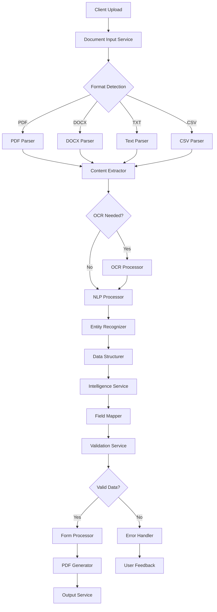
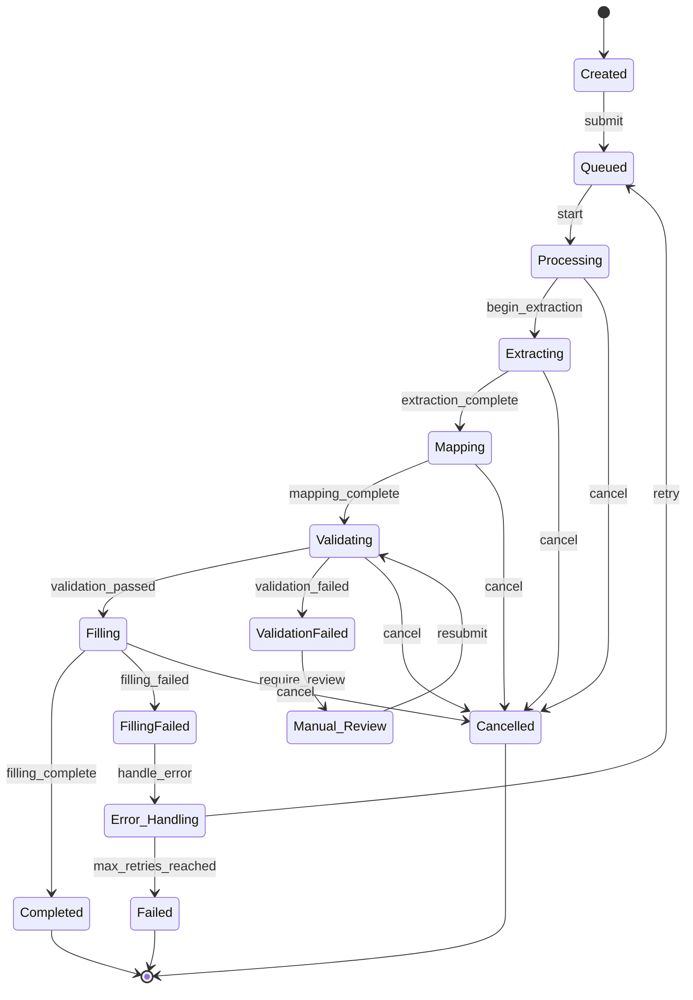

# Data Flow Design Specification

## 1. Overview

This document details the data flow architecture for the PDF-filler tool, including data transformations, state transitions, and inter-service communication patterns.

## 2. High-Level Data Flow



## 3. Data Models and Transformations

### 3.1 Document Processing Pipeline

#### Input Document Model

```typescript
interface RawDocument {
  id: string;
  filename: string;
  contentType: string;
  size: number;
  buffer: Buffer;
  uploadedAt: Date;
  metadata: {
    originalFilename: string;
    clientInfo?: ClientInfo;
    processingOptions?: ProcessingOptions;
  };
}
```

#### Document Analysis Result

```typescript
interface DocumentAnalysis {
  documentId: string;
  format: DocumentFormat;
  detectedLanguage: string;
  pageCount: number;
  hasImages: boolean;
  isScanned: boolean;
  complexity: ComplexityLevel;
  estimatedProcessingTime: number;
  structure: DocumentStructure;
}

interface DocumentStructure {
  sections: Section[];
  tables: TableReference[];
  images: ImageReference[];
  forms: FormReference[];
  headers: HeaderFooter[];
  footers: HeaderFooter[];
}
```

### 3.2 Content Extraction Pipeline

#### Raw Content Model

```typescript
interface RawContent {
  documentId: string;
  text: string;
  pages: PageContent[];
  tables: ExtractedTable[];
  images: ExtractedImage[];
  metadata: ContentMetadata;
}

interface PageContent {
  pageNumber: number;
  text: string;
  layout: LayoutInfo;
  elements: PageElement[];
}

interface ExtractedTable {
  id: string;
  pageNumber: number;
  boundingBox: BoundingBox;
  headers: string[];
  rows: string[][];
  confidence: number;
}
```

#### Structured Data Model

```typescript
interface StructuredData {
  documentId: string;
  entities: ExtractedEntity[];
  relationships: DataRelationship[];
  keyValuePairs: KeyValuePair[];
  sections: StructuredSection[];
  confidence: ConfidenceMetrics;
}

interface ExtractedEntity {
  text: string;
  label: EntityLabel;
  confidence: number;
  position: TextPosition;
  context: string;
  normalized?: string;
}

enum EntityLabel {
  PERSON = 'person',
  ORGANIZATION = 'organization',
  DATE = 'date',
  MONEY = 'money',
  ADDRESS = 'address',
  PHONE = 'phone',
  EMAIL = 'email',
  ID_NUMBER = 'id_number',
  CUSTOM = 'custom',
}

interface KeyValuePair {
  key: string;
  value: string;
  confidence: number;
  type: DataType;
  source: TextPosition;
}
```

### 3.3 Intelligence Processing Pipeline

#### Field Mapping Model

```typescript
interface FieldMappingData {
  sourceData: StructuredData;
  targetSchema: FormSchema;
  mappings: FieldMapping[];
  unmappedData: UnmappedField[];
  confidence: number;
  requiresReview: boolean;
}

interface FieldMapping {
  id: string;
  sourceField: SourceField;
  targetField: TargetField;
  transformation: DataTransformation;
  confidence: number;
  validationRules: ValidationRule[];
}

interface SourceField {
  path: string;
  value: any;
  type: DataType;
  context: string;
  alternatives?: AlternativeValue[];
}

interface TargetField {
  name: string;
  type: FieldType;
  constraints: FieldConstraints;
  position: FormFieldPosition;
}
```

#### Data Transformation Model

```typescript
interface DataTransformation {
  type: TransformationType;
  input: TransformationInput;
  output: TransformationOutput;
  rules: TransformationRule[];
  confidence: number;
}

enum TransformationType {
  DIRECT_COPY = 'direct_copy',
  FORMAT_CONVERSION = 'format_conversion',
  DATA_EXTRACTION = 'data_extraction',
  DATA_COMBINATION = 'data_combination',
  CALCULATION = 'calculation',
  LOOKUP = 'lookup',
}

interface TransformationRule {
  condition: string; // JavaScript expression
  action: TransformationAction;
  parameters: Record<string, any>;
}
```

### 3.4 Validation Pipeline

#### Validation Request Model

```typescript
interface ValidationRequest {
  mappingId: string;
  data: MappedData;
  schema: ValidationSchema;
  options: ValidationOptions;
}

interface MappedData {
  fields: MappedField[];
  metadata: MappingMetadata;
}

interface MappedField {
  name: string;
  value: any;
  sourceField: string;
  transformation: DataTransformation;
  confidence: number;
}
```

#### Validation Result Model

```typescript
interface ValidationResult {
  valid: boolean;
  fieldResults: FieldValidationResult[];
  crossFieldResults: CrossFieldValidationResult[];
  errors: ValidationError[];
  warnings: ValidationWarning[];
  summary: ValidationSummary;
}

interface FieldValidationResult {
  fieldName: string;
  valid: boolean;
  errors: FieldValidationError[];
  warnings: FieldValidationWarning[];
  suggestions: string[];
}
```

### 3.5 Form Processing Pipeline

#### Form Fill Request Model

```typescript
interface FormFillRequest {
  formId: string;
  validatedData: ValidatedData;
  options: FormFillOptions;
}

interface ValidatedData {
  fields: ValidatedField[];
  metadata: ValidationMetadata;
}

interface ValidatedField {
  name: string;
  value: any;
  formatted: string;
  confidence: number;
  validationStatus: ValidationStatus;
}
```

#### Form Fill Result Model

```typescript
interface FormFillResult {
  filledFormId: string;
  originalFormId: string;
  fillStatus: FillStatus;
  filledFields: FilledField[];
  unfilledFields: string[];
  warnings: FillWarning[];
  processingTime: number;
  outputUrl: string;
  expiresAt: Date;
}

interface FilledField {
  name: string;
  originalValue?: string;
  filledValue: string;
  fillMethod: FillMethod;
  success: boolean;
}

enum FillMethod {
  DIRECT_FILL = 'direct_fill',
  OVERLAY = 'overlay',
  ANNOTATION = 'annotation',
}
```

## 4. State Management

### 4.1 Job State Machine



### 4.2 Document Lifecycle States

```typescript
enum DocumentState {
  UPLOADED = 'uploaded',
  ANALYZING = 'analyzing',
  ANALYZED = 'analyzed',
  PARSING = 'parsing',
  PARSED = 'parsed',
  EXTRACTING = 'extracting',
  EXTRACTED = 'extracted',
  READY = 'ready',
  ERROR = 'error',
  ARCHIVED = 'archived',
}

interface DocumentStateTransition {
  from: DocumentState;
  to: DocumentState;
  event: string;
  condition?: (document: Document) => boolean;
  action?: (document: Document) => Promise<void>;
}
```

## 5. Data Flow Patterns

### 5.1 Asynchronous Processing Pattern

```typescript
interface AsyncProcessingFlow {
  // Step 1: Create job and return immediately
  initiateProcessing(request: ProcessingRequest): Promise<JobId>;

  // Step 2: Process asynchronously with status updates
  processAsync(jobId: JobId): Promise<void>;

  // Step 3: Client polls for status
  getStatus(jobId: JobId): Promise<JobStatus>;

  // Step 4: Client retrieves results when complete
  getResult(jobId: JobId): Promise<ProcessingResult>;
}

// Event-driven updates
interface ProcessingEvents {
  onProgress(jobId: JobId, progress: ProgressInfo): void;
  onStepComplete(jobId: JobId, step: ProcessingStep): void;
  onError(jobId: JobId, error: ProcessingError): void;
  onComplete(jobId: JobId, result: ProcessingResult): void;
}
```

### 5.2 Pipeline Processing Pattern

```typescript
interface PipelineProcessor<TInput, TOutput> {
  process(input: TInput): Promise<TOutput>;
}

// Example pipeline implementation
class DocumentProcessingPipeline implements PipelineProcessor<RawDocument, FilledForm> {
  private stages: ProcessingStage[] = [
    new DocumentAnalysisStage(),
    new ContentExtractionStage(),
    new DataStructuringStage(),
    new IntelligentMappingStage(),
    new ValidationStage(),
    new FormFillingStage(),
  ];

  async process(document: RawDocument): Promise<FilledForm> {
    let data: any = document;

    for (const stage of this.stages) {
      try {
        data = await stage.process(data);
        await this.publishStageComplete(stage.name, data);
      } catch (error) {
        await this.handleStageError(stage.name, error, data);
        throw error;
      }
    }

    return data as FilledForm;
  }
}
```

### 5.3 Error Recovery Pattern

```typescript
interface ErrorRecoveryFlow {
  // Automatic retry with exponential backoff
  retryOperation<T>(operation: () => Promise<T>, maxRetries: number, backoffMs: number): Promise<T>;

  // Circuit breaker pattern
  withCircuitBreaker<T>(operation: () => Promise<T>, options: CircuitBreakerOptions): Promise<T>;

  // Fallback to alternative processing
  withFallback<T>(primary: () => Promise<T>, fallback: () => Promise<T>): Promise<T>;
}

interface CircuitBreakerOptions {
  failureThreshold: number;
  resetTimeoutMs: number;
  monitoringWindowMs: number;
}
```

## 6. Data Persistence Strategy

### 6.1 Database Schema Design

```sql
-- Job tracking table
CREATE TABLE jobs (
    id UUID PRIMARY KEY DEFAULT gen_random_uuid(),
    type VARCHAR(50) NOT NULL,
    status VARCHAR(20) NOT NULL,
    progress INTEGER DEFAULT 0,
    created_at TIMESTAMPTZ DEFAULT NOW(),
    started_at TIMESTAMPTZ,
    completed_at TIMESTAMPTZ,
    input_data JSONB,
    result_data JSONB,
    error_data JSONB,
    metadata JSONB
);

-- Document metadata table
CREATE TABLE documents (
    id UUID PRIMARY KEY DEFAULT gen_random_uuid(),
    filename VARCHAR(255) NOT NULL,
    content_type VARCHAR(100),
    size BIGINT,
    format VARCHAR(20),
    state VARCHAR(20) DEFAULT 'uploaded',
    uploaded_at TIMESTAMPTZ DEFAULT NOW(),
    storage_path VARCHAR(500),
    metadata JSONB
);

-- Extracted data table
CREATE TABLE extracted_data (
    id UUID PRIMARY KEY DEFAULT gen_random_uuid(),
    document_id UUID REFERENCES documents(id),
    extraction_type VARCHAR(50),
    data JSONB,
    confidence DECIMAL(3,2),
    extracted_at TIMESTAMPTZ DEFAULT NOW()
);

-- Field mappings table
CREATE TABLE field_mappings (
    id UUID PRIMARY KEY DEFAULT gen_random_uuid(),
    source_schema_hash VARCHAR(64),
    target_schema_hash VARCHAR(64),
    mappings JSONB,
    confidence DECIMAL(3,2),
    created_at TIMESTAMPTZ DEFAULT NOW(),
    usage_count INTEGER DEFAULT 0,
    last_used_at TIMESTAMPTZ
);
```

### 6.2 Caching Strategy

```typescript
interface CacheStrategy {
  // L1 Cache: In-memory service cache
  serviceCache: Map<string, CacheEntry>;

  // L2 Cache: Distributed Redis cache
  distributedCache: RedisClient;

  // L3 Cache: Document storage cache
  documentCache: StorageCache;
}

interface CacheEntry {
  key: string;
  value: any;
  ttl: number;
  created: Date;
  accessed: Date;
  hitCount: number;
}

// Cache implementation
class MultiLevelCache {
  async get<T>(key: string): Promise<T | null> {
    // Try L1 cache first
    let value = this.serviceCache.get(key);
    if (value && !this.isExpired(value)) {
      value.hitCount++;
      value.accessed = new Date();
      return value.value;
    }

    // Try L2 cache
    const redisValue = await this.distributedCache.get(key);
    if (redisValue) {
      // Promote to L1 cache
      this.serviceCache.set(key, {
        key,
        value: JSON.parse(redisValue),
        ttl: 300000, // 5 minutes
        created: new Date(),
        accessed: new Date(),
        hitCount: 1,
      });
      return JSON.parse(redisValue);
    }

    return null;
  }

  async set<T>(key: string, value: T, ttl: number = 300000): Promise<void> {
    // Set in both caches
    this.serviceCache.set(key, {
      key,
      value,
      ttl,
      created: new Date(),
      accessed: new Date(),
      hitCount: 0,
    });

    await this.distributedCache.setex(key, ttl / 1000, JSON.stringify(value));
  }
}
```

## 7. Performance Optimizations

### 7.1 Batch Processing

```typescript
interface BatchProcessor<T, R> {
  batchSize: number;
  processingTimeout: number;

  processBatch(items: T[]): Promise<BatchResult<R>>;
}

class DocumentBatchProcessor implements BatchProcessor<Document, ProcessingResult> {
  batchSize = 10;
  processingTimeout = 300000; // 5 minutes

  async processBatch(documents: Document[]): Promise<BatchResult<ProcessingResult>> {
    const batches = this.createBatches(documents, this.batchSize);
    const results: ProcessingResult[] = [];
    const errors: BatchError[] = [];

    for (const batch of batches) {
      try {
        const batchResults = await Promise.allSettled(
          batch.map((doc) => this.processDocument(doc))
        );

        batchResults.forEach((result, index) => {
          if (result.status === 'fulfilled') {
            results.push(result.value);
          } else {
            errors.push({
              documentId: batch[index].id,
              error: result.reason,
            });
          }
        });
      } catch (error) {
        // Handle batch-level errors
        batch.forEach((doc) => {
          errors.push({
            documentId: doc.id,
            error: error as Error,
          });
        });
      }
    }

    return {
      successful: results,
      failed: errors,
      totalProcessed: documents.length,
    };
  }
}
```

### 7.2 Streaming Processing

```typescript
interface StreamProcessor {
  processStream<T, R>(
    inputStream: ReadableStream<T>,
    processor: (item: T) => Promise<R>
  ): ReadableStream<R>;
}

class DocumentStreamProcessor implements StreamProcessor {
  processStream<T, R>(
    inputStream: ReadableStream<T>,
    processor: (item: T) => Promise<R>
  ): ReadableStream<R> {
    return new ReadableStream<R>({
      async start(controller) {
        const reader = inputStream.getReader();

        try {
          while (true) {
            const { done, value } = await reader.read();

            if (done) break;

            try {
              const result = await processor(value);
              controller.enqueue(result);
            } catch (error) {
              console.error('Processing error:', error);
              // Continue with next item
            }
          }
        } catch (error) {
          controller.error(error);
        } finally {
          controller.close();
          reader.releaseLock();
        }
      },
    });
  }
}
```

## 8. Data Quality and Monitoring

### 8.1 Data Quality Metrics

```typescript
interface DataQualityMetrics {
  completeness: number; // Percentage of fields filled
  accuracy: number; // Confidence score average
  consistency: number; // Cross-field validation score
  timeliness: number; // Processing time vs SLA
  validity: number; // Validation pass rate
}

class DataQualityMonitor {
  async assessQuality(
    extractedData: StructuredData,
    mappingResult: FieldMappingData,
    validationResult: ValidationResult
  ): Promise<DataQualityMetrics> {
    const completeness = this.calculateCompleteness(extractedData);
    const accuracy = this.calculateAccuracy(mappingResult);
    const consistency = this.calculateConsistency(validationResult);
    const timeliness = this.calculateTimeliness();
    const validity = this.calculateValidity(validationResult);

    return {
      completeness,
      accuracy,
      consistency,
      timeliness,
      validity,
    };
  }

  private calculateCompleteness(data: StructuredData): number {
    const totalFields = data.entities.length;
    const populatedFields = data.entities.filter((e) => e.text.trim() !== '').length;
    return totalFields > 0 ? (populatedFields / totalFields) * 100 : 0;
  }
}
```

### 8.2 Performance Monitoring

```typescript
interface PerformanceMetrics {
  processingTime: number;
  throughput: number; // Documents per hour
  errorRate: number; // Percentage of failed jobs
  resourceUtilization: ResourceMetrics;
}

interface ResourceMetrics {
  cpuUsage: number;
  memoryUsage: number;
  diskUsage: number;
  networkIO: number;
}

class PerformanceMonitor {
  private metrics: Map<string, PerformanceMetrics> = new Map();

  async recordProcessingTime(operation: string, startTime: Date, endTime: Date): Promise<void> {
    const processingTime = endTime.getTime() - startTime.getTime();

    const existingMetrics = this.metrics.get(operation) || this.getDefaultMetrics();
    existingMetrics.processingTime = processingTime;

    this.metrics.set(operation, existingMetrics);

    // Emit metrics to monitoring system
    await this.emitMetrics(operation, existingMetrics);
  }
}
```

This comprehensive data flow design ensures efficient, scalable, and maintainable data processing throughout the PDF-filler tool's pipeline, with robust error handling, performance optimization, and quality monitoring.
