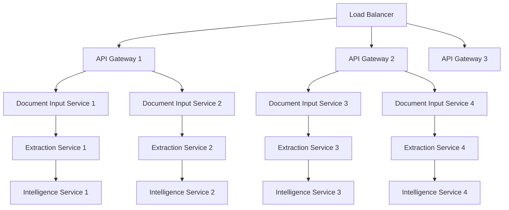

# Scalability Design Specification

## 1. Overview

This document outlines the scalability architecture for the PDF-filler tool, designed to handle enterprise-scale workloads with thousands of concurrent users and millions of document processing requests per day.

## 2. Scalability Requirements

### 2.1 Performance Targets
```yaml
Throughput:
  - Peak: 10,000 documents/hour
  - Sustained: 5,000 documents/hour
  - Concurrent Users: 1,000+
  - Response Time: <2 seconds (95th percentile)
  
Resource Scaling:
  - CPU: Auto-scale from 10% to 80% utilization
  - Memory: Linear scaling with document size
  - Storage: Unlimited horizontal scaling
  - Network: 10Gbps+ bandwidth capacity
```

### 2.2 Availability Targets
```yaml
SLA Targets:
  - Uptime: 99.9% (8.76 hours downtime/year)
  - RTO: 15 minutes (Recovery Time Objective)
  - RPO: 5 minutes (Recovery Point Objective)
  - Data Durability: 99.999999999% (11 9's)
```

## 3. Horizontal Scaling Architecture

### 3.1 Microservices Scaling Strategy



#### Service-Specific Scaling Profiles
```typescript
interface ScalingProfile {
  serviceName: string
  minReplicas: number
  maxReplicas: number
  targetCPU: number
  targetMemory: number
  scaleUpPolicy: ScalePolicy
  scaleDownPolicy: ScalePolicy
}

const scalingProfiles: ScalingProfile[] = [
  {
    serviceName: 'document-input-service',
    minReplicas: 3,
    maxReplicas: 20,
    targetCPU: 70,
    targetMemory: 80,
    scaleUpPolicy: {
      stabilizationWindowSeconds: 60,
      periodSeconds: 15,
      policies: [{
        type: 'Percent',
        value: 100,
        periodSeconds: 15
      }]
    },
    scaleDownPolicy: {
      stabilizationWindowSeconds: 300,
      periodSeconds: 60,
      policies: [{
        type: 'Percent',
        value: 10,
        periodSeconds: 60
      }]
    }
  },
  {
    serviceName: 'intelligence-service',
    minReplicas: 2,
    maxReplicas: 10,
    targetCPU: 60,
    targetMemory: 75,
    scaleUpPolicy: {
      stabilizationWindowSeconds: 120,
      periodSeconds: 30,
      policies: [{
        type: 'Pods',
        value: 2,
        periodSeconds: 30
      }]
    }
  }
]
```

### 3.2 Kubernetes Horizontal Pod Autoscaler (HPA)

```yaml
# document-input-hpa.yaml
apiVersion: autoscaling/v2
kind: HorizontalPodAutoscaler
metadata:
  name: document-input-hpa
  namespace: pdffiller
spec:
  scaleTargetRef:
    apiVersion: apps/v1
    kind: Deployment
    name: document-input-service
  minReplicas: 3
  maxReplicas: 20
  metrics:
  - type: Resource
    resource:
      name: cpu
      target:
        type: Utilization
        averageUtilization: 70
  - type: Resource
    resource:
      name: memory
      target:
        type: Utilization
        averageUtilization: 80
  - type: Pods
    pods:
      metric:
        name: processing_queue_length
      target:
        type: AverageValue
        averageValue: "10"
  behavior:
    scaleUp:
      stabilizationWindowSeconds: 60
      policies:
      - type: Percent
        value: 100
        periodSeconds: 15
    scaleDown:
      stabilizationWindowSeconds: 300
      policies:
      - type: Percent
        value: 10
        periodSeconds: 60
```

### 3.3 Custom Metrics Scaling

```typescript
import { PrometheusRegistry, register } from 'prom-client'

class CustomMetricsCollector {
  private queueLengthGauge = new register.Gauge({
    name: 'processing_queue_length',
    help: 'Current length of processing queue',
    labelNames: ['queue_type', 'priority']
  })
  
  private processingTimeHistogram = new register.Histogram({
    name: 'document_processing_duration_seconds',
    help: 'Time taken to process documents',
    labelNames: ['document_type', 'size_category'],
    buckets: [1, 5, 10, 30, 60, 300, 600]
  })
  
  async updateQueueMetrics(): Promise<void> {
    const queues = await this.getQueueLengths()
    
    for (const [queueType, length] of Object.entries(queues)) {
      this.queueLengthGauge.set(
        { queue_type: queueType, priority: 'high' },
        length.high
      )
      this.queueLengthGauge.set(
        { queue_type: queueType, priority: 'normal' },
        length.normal
      )
    }
  }
}
```

## 4. Vertical Scaling Strategies

### 4.1 Resource Allocation by Workload

```yaml
# Resource allocation matrix
Services:
  document-input-service:
    small_load:
      cpu: "500m"
      memory: "1Gi"
    medium_load:
      cpu: "1000m" 
      memory: "2Gi"
    high_load:
      cpu: "2000m"
      memory: "4Gi"
  
  extraction-service:
    small_load:
      cpu: "1000m"
      memory: "2Gi"
    medium_load:
      cpu: "2000m"
      memory: "4Gi"
    high_load:
      cpu: "4000m"
      memory: "8Gi"
  
  intelligence-service:
    small_load:
      cpu: "2000m"
      memory: "4Gi"
    medium_load:
      cpu: "4000m"
      memory: "8Gi"
    high_load:
      cpu: "8000m"
      memory: "16Gi"
```

### 4.2 Vertical Pod Autoscaler (VPA)

```yaml
# intelligence-service-vpa.yaml
apiVersion: autoscaling.k8s.io/v1
kind: VerticalPodAutoscaler
metadata:
  name: intelligence-service-vpa
spec:
  targetRef:
    apiVersion: apps/v1
    kind: Deployment
    name: intelligence-service
  updatePolicy:
    updateMode: "Auto"
  resourcePolicy:
    containerPolicies:
    - containerName: intelligence-service
      minAllowed:
        cpu: "500m"
        memory: "1Gi"
      maxAllowed:
        cpu: "8000m"
        memory: "16Gi"
      controlledResources: ["cpu", "memory"]
      controlledValues: RequestsAndLimits
```

## 5. Database Scaling Architecture

### 5.1 PostgreSQL Scaling Strategy

#### Read Replica Configuration
```typescript
import { Pool } from 'pg'

class DatabaseConnectionManager {
  private writePool: Pool
  private readPools: Pool[]
  private currentReadIndex = 0
  
  constructor() {
    // Master database for writes
    this.writePool = new Pool({
      host: process.env.DB_WRITE_HOST,
      port: 5432,
      database: process.env.DB_NAME,
      user: process.env.DB_USER,
      password: process.env.DB_PASSWORD,
      max: 20,
      idleTimeoutMillis: 30000
    })
    
    // Read replicas for load distribution
    this.readPools = [
      new Pool({ host: process.env.DB_READ_HOST_1, /* ... */ }),
      new Pool({ host: process.env.DB_READ_HOST_2, /* ... */ }),
      new Pool({ host: process.env.DB_READ_HOST_3, /* ... */ })
    ]
  }
  
  getWriteConnection(): Pool {
    return this.writePool
  }
  
  getReadConnection(): Pool {
    const pool = this.readPools[this.currentReadIndex]
    this.currentReadIndex = (this.currentReadIndex + 1) % this.readPools.length
    return pool
  }
  
  async query(sql: string, params: any[], readOnly: boolean = true): Promise<any> {
    const pool = readOnly ? this.getReadConnection() : this.getWriteConnection()
    return await pool.query(sql, params)
  }
}
```

#### Partitioning Strategy
```sql
-- Partition jobs table by date
CREATE TABLE jobs_partitioned (
    id UUID DEFAULT gen_random_uuid(),
    type VARCHAR(50) NOT NULL,
    status VARCHAR(20) NOT NULL,
    created_at TIMESTAMPTZ DEFAULT NOW(),
    completed_at TIMESTAMPTZ,
    data JSONB
) PARTITION BY RANGE (created_at);

-- Create monthly partitions
CREATE TABLE jobs_2024_01 PARTITION OF jobs_partitioned
    FOR VALUES FROM ('2024-01-01') TO ('2024-02-01');

CREATE TABLE jobs_2024_02 PARTITION OF jobs_partitioned
    FOR VALUES FROM ('2024-02-01') TO ('2024-03-01');

-- Automatic partition creation
CREATE OR REPLACE FUNCTION create_monthly_partition()
RETURNS VOID AS $$
DECLARE
    start_date DATE;
    end_date DATE;
    partition_name TEXT;
BEGIN
    start_date := DATE_TRUNC('month', CURRENT_DATE + INTERVAL '1 month');
    end_date := start_date + INTERVAL '1 month';
    partition_name := 'jobs_' || TO_CHAR(start_date, 'YYYY_MM');
    
    EXECUTE format('CREATE TABLE %I PARTITION OF jobs_partitioned
                   FOR VALUES FROM (%L) TO (%L)',
                   partition_name, start_date, end_date);
END;
$$ LANGUAGE plpgsql;

-- Schedule partition creation
SELECT cron.schedule('create-partition', '0 0 25 * *', 'SELECT create_monthly_partition();');
```

### 5.2 Caching Layer Scaling

#### Redis Cluster Configuration
```typescript
import Redis from 'ioredis'

class RedisClusterManager {
  private cluster: Redis.Cluster
  
  constructor() {
    this.cluster = new Redis.Cluster([
      { host: 'redis-node-1', port: 6379 },
      { host: 'redis-node-2', port: 6379 },
      { host: 'redis-node-3', port: 6379 },
      { host: 'redis-node-4', port: 6379 },
      { host: 'redis-node-5', port: 6379 },
      { host: 'redis-node-6', port: 6379 }
    ], {
      redisOptions: {
        password: process.env.REDIS_PASSWORD,
        maxRetriesPerRequest: 3,
        retryDelayOnFailover: 100
      },
      maxRedirections: 16,
      retryDelayOnClusterDown: 300,
      enableOfflineQueue: false,
      lazyConnect: true
    })
  }
  
  async getWithFallback<T>(key: string): Promise<T | null> {
    try {
      const result = await this.cluster.get(key)
      return result ? JSON.parse(result) : null
    } catch (error) {
      console.error(`Cache get error for key ${key}:`, error)
      // Implement fallback to database or other cache
      return null
    }
  }
  
  async setWithRetry<T>(key: string, value: T, ttl: number = 3600): Promise<void> {
    let retries = 3
    while (retries > 0) {
      try {
        await this.cluster.setex(key, ttl, JSON.stringify(value))
        return
      } catch (error) {
        retries--
        if (retries === 0) {
          console.error(`Failed to set cache key ${key} after all retries:`, error)
        } else {
          await this.sleep(100 * (4 - retries))
        }
      }
    }
  }
  
  private sleep(ms: number): Promise<void> {
    return new Promise(resolve => setTimeout(resolve, ms))
  }
}
```

## 6. Queue and Message Processing Scaling

### 6.1 Multi-Queue Architecture

```typescript
interface QueueConfiguration {
  name: string
  priority: number
  concurrency: number
  retryAttempts: number
  backoffStrategy: BackoffStrategy
}

class QueueManager {
  private queues: Map<string, Queue> = new Map()
  
  constructor() {
    const configs: QueueConfiguration[] = [
      {
        name: 'high-priority-processing',
        priority: 10,
        concurrency: 5,
        retryAttempts: 3,
        backoffStrategy: 'exponential'
      },
      {
        name: 'normal-processing',
        priority: 5,
        concurrency: 10,
        retryAttempts: 2,
        backoffStrategy: 'linear'
      },
      {
        name: 'bulk-processing',
        priority: 1,
        concurrency: 20,
        retryAttempts: 1,
        backoffStrategy: 'fixed'
      }
    ]
    
    configs.forEach(config => {
      this.createQueue(config)
    })
  }
  
  private createQueue(config: QueueConfiguration): void {
    const queue = new Queue(config.name, {
      redis: {
        host: process.env.REDIS_HOST,
        port: parseInt(process.env.REDIS_PORT || '6379')
      },
      defaultJobOptions: {
        priority: config.priority,
        attempts: config.retryAttempts,
        backoff: this.getBackoffConfig(config.backoffStrategy),
        removeOnComplete: 100,
        removeOnFail: 50
      }
    })
    
    // Set up processors with concurrency
    queue.process('document-processing', config.concurrency, this.processDocument)
    
    this.queues.set(config.name, queue)
  }
  
  async addJob(queueName: string, jobType: string, data: any, options?: any): Promise<void> {
    const queue = this.queues.get(queueName)
    if (!queue) throw new Error(`Queue ${queueName} not found`)
    
    await queue.add(jobType, data, {
      ...options,
      timestamp: Date.now()
    })
  }
}
```

### 6.2 Queue Auto-Scaling Based on Depth

```typescript
class QueueAutoScaler {
  private readonly scaleUpThreshold = 50
  private readonly scaleDownThreshold = 10
  private readonly minWorkers = 2
  private readonly maxWorkers = 20
  
  async monitorAndScale(): Promise<void> {
    const queues = await this.getQueueStats()
    
    for (const [queueName, stats] of Object.entries(queues)) {
      const currentWorkers = await this.getCurrentWorkerCount(queueName)
      const queueDepth = stats.waiting + stats.active
      
      if (queueDepth > this.scaleUpThreshold && currentWorkers < this.maxWorkers) {
        const newWorkerCount = Math.min(
          currentWorkers + Math.ceil(queueDepth / this.scaleUpThreshold),
          this.maxWorkers
        )
        await this.scaleWorkers(queueName, newWorkerCount)
        
      } else if (queueDepth < this.scaleDownThreshold && currentWorkers > this.minWorkers) {
        const newWorkerCount = Math.max(
          currentWorkers - 1,
          this.minWorkers
        )
        await this.scaleWorkers(queueName, newWorkerCount)
      }
    }
  }
  
  private async scaleWorkers(queueName: string, targetCount: number): Promise<void> {
    // Scale Kubernetes deployment
    const kubectlCommand = `kubectl scale deployment ${queueName}-worker --replicas=${targetCount}`
    await this.execCommand(kubectlCommand)
    
    console.log(`Scaled ${queueName} workers to ${targetCount}`)
  }
}
```

## 7. Storage Scaling Architecture

### 7.1 Object Storage Scaling

```typescript
interface StorageConfiguration {
  bucket: string
  region: string
  storageClass: string
  replicationRules: ReplicationRule[]
  lifecycleRules: LifecycleRule[]
}

class ScalableStorageManager {
  private s3Clients: Map<string, S3Client> = new Map()
  private bucketConfigurations: Map<string, StorageConfiguration> = new Map()
  
  constructor() {
    this.initializeBuckets([
      {
        bucket: 'pdffiller-documents-hot',
        region: 'us-east-1',
        storageClass: 'STANDARD',
        replicationRules: [
          {
            destinationBucket: 'pdffiller-documents-replica',
            destinationRegion: 'us-west-2'
          }
        ],
        lifecycleRules: [
          {
            transition: {
              days: 30,
              storageClass: 'STANDARD_IA'
            }
          },
          {
            transition: {
              days: 90,
              storageClass: 'GLACIER'
            }
          }
        ]
      }
    ])
  }
  
  async storeDocument(
    key: string, 
    buffer: Buffer, 
    metadata: DocumentMetadata
  ): Promise<string> {
    const bucket = this.selectOptimalBucket(metadata)
    const client = this.s3Clients.get(bucket.region)!
    
    const uploadParams = {
      Bucket: bucket.bucket,
      Key: key,
      Body: buffer,
      StorageClass: bucket.storageClass,
      Metadata: {
        'document-type': metadata.type,
        'file-size': metadata.size.toString(),
        'upload-timestamp': Date.now().toString()
      },
      ServerSideEncryption: 'AES256'
    }
    
    await client.send(new PutObjectCommand(uploadParams))
    
    return `s3://${bucket.bucket}/${key}`
  }
  
  private selectOptimalBucket(metadata: DocumentMetadata): StorageConfiguration {
    // Route based on size, frequency, geographic location, etc.
    if (metadata.size > 100 * 1024 * 1024) { // 100MB+
      return this.bucketConfigurations.get('large-documents')!
    } else if (metadata.accessPattern === 'frequent') {
      return this.bucketConfigurations.get('hot-storage')!
    } else {
      return this.bucketConfigurations.get('standard-storage')!
    }
  }
}
```

### 7.2 CDN Integration for Global Scale

```typescript
class CDNManager {
  private cloudFrontDistributions: Map<string, string> = new Map()
  
  constructor() {
    this.cloudFrontDistributions.set('us-east-1', 'E1234567890ABC')
    this.cloudFrontDistributions.set('eu-west-1', 'E0987654321DEF')
    this.cloudFrontDistributions.set('ap-southeast-1', 'E1122334455GHI')
  }
  
  async generatePresignedUrl(
    documentKey: string, 
    expiresIn: number = 3600,
    userLocation?: string
  ): Promise<string> {
    const region = this.getOptimalRegion(userLocation)
    const distributionId = this.cloudFrontDistributions.get(region)!
    
    const cloudFrontSigner = new AWS.CloudFront.Signer(
      process.env.CLOUDFRONT_KEY_PAIR_ID!,
      process.env.CLOUDFRONT_PRIVATE_KEY!
    )
    
    const signedUrl = cloudFrontSigner.getSignedUrl({
      url: `https://${distributionId}.cloudfront.net/${documentKey}`,
      expires: Math.floor(Date.now() / 1000) + expiresIn
    })
    
    return signedUrl
  }
}
```

## 8. Network Scaling and Load Balancing

### 8.1 Multi-Layer Load Balancing

```yaml
# NGINX configuration for application-level load balancing
upstream document_processing_backend {
    # Weighted round-robin with health checks
    server doc-proc-1:3001 weight=3 max_fails=3 fail_timeout=30s;
    server doc-proc-2:3001 weight=3 max_fails=3 fail_timeout=30s;
    server doc-proc-3:3001 weight=2 max_fails=3 fail_timeout=30s;
    
    # Backup server
    server doc-proc-backup:3001 backup;
    
    # Connection pooling
    keepalive 32;
    keepalive_requests 100;
    keepalive_timeout 60s;
}

server {
    listen 80;
    
    # Rate limiting by IP
    limit_req_zone $binary_remote_addr zone=api:10m rate=10r/s;
    
    location /api/v1/documents {
        limit_req zone=api burst=20 nodelay;
        
        proxy_pass http://document_processing_backend;
        proxy_http_version 1.1;
        proxy_set_header Connection "";
        proxy_set_header Host $host;
        proxy_set_header X-Real-IP $remote_addr;
        proxy_set_header X-Forwarded-For $proxy_add_x_forwarded_for;
        
        # Connection and timeout settings
        proxy_connect_timeout 5s;
        proxy_send_timeout 60s;
        proxy_read_timeout 60s;
        
        # Response buffering
        proxy_buffering on;
        proxy_buffer_size 8k;
        proxy_buffers 16 8k;
    }
}
```

### 8.2 Global Load Balancing with DNS

```typescript
class GeographicLoadBalancer {
  private readonly endpoints = new Map([
    ['us-east', 'api-us-east.pdffiller.com'],
    ['us-west', 'api-us-west.pdffiller.com'],
    ['eu-west', 'api-eu-west.pdffiller.com'],
    ['ap-southeast', 'api-ap-southeast.pdffiller.com']
  ])
  
  getOptimalEndpoint(clientIP: string): string {
    const location = this.getLocationFromIP(clientIP)
    const region = this.mapLocationToRegion(location)
    
    // Check regional endpoint health
    const preferredEndpoint = this.endpoints.get(region)
    if (preferredEndpoint && this.isHealthy(preferredEndpoint)) {
      return preferredEndpoint
    }
    
    // Failover to nearest healthy endpoint
    return this.getNearestHealthyEndpoint(location)
  }
  
  private async isHealthy(endpoint: string): Promise<boolean> {
    try {
      const response = await fetch(`https://${endpoint}/health`, {
        timeout: 5000
      })
      return response.status === 200
    } catch (error) {
      return false
    }
  }
}
```

## 9. Auto-Scaling Monitoring and Alerting

### 9.1 Custom Metrics for Scaling Decisions

```typescript
class ScalingMetricsCollector {
  private metrics = {
    documentProcessingRate: new prometheus.Gauge({
      name: 'documents_processed_per_minute',
      help: 'Number of documents processed per minute'
    }),
    
    queueDepth: new prometheus.Gauge({
      name: 'processing_queue_depth',
      help: 'Current depth of processing queues',
      labelNames: ['queue_type', 'priority']
    }),
    
    resourceUtilization: new prometheus.Gauge({
      name: 'resource_utilization_percentage',
      help: 'Resource utilization percentage',
      labelNames: ['resource_type', 'service']
    }),
    
    responseTime: new prometheus.Histogram({
      name: 'api_response_time_seconds',
      help: 'API response time in seconds',
      labelNames: ['endpoint', 'method'],
      buckets: [0.1, 0.3, 0.5, 0.7, 1, 3, 5, 7, 10]
    })
  }
  
  async collectMetrics(): Promise<void> {
    // Collect processing rate
    const processingRate = await this.getProcessingRate()
    this.metrics.documentProcessingRate.set(processingRate)
    
    // Collect queue depths
    const queueStats = await this.getQueueStats()
    for (const [queueName, stats] of Object.entries(queueStats)) {
      this.metrics.queueDepth.set(
        { queue_type: queueName, priority: 'high' },
        stats.high
      )
      this.metrics.queueDepth.set(
        { queue_type: queueName, priority: 'normal' },
        stats.normal
      )
    }
    
    // Collect resource utilization
    const resourceStats = await this.getResourceStats()
    for (const [service, resources] of Object.entries(resourceStats)) {
      this.metrics.resourceUtilization.set(
        { resource_type: 'cpu', service },
        resources.cpu
      )
      this.metrics.resourceUtilization.set(
        { resource_type: 'memory', service },
        resources.memory
      )
    }
  }
}
```

### 9.2 Predictive Scaling

```typescript
class PredictiveScaler {
  private historicalData: ScalingData[] = []
  private predictionModel: any // ML model for prediction
  
  async predictFutureLoad(timeHorizonMinutes: number): Promise<LoadPrediction> {
    const features = this.extractFeatures()
    const prediction = await this.predictionModel.predict(features)
    
    return {
      expectedLoad: prediction.load,
      confidence: prediction.confidence,
      recommendedScale: this.calculateRecommendedScale(prediction.load),
      timeHorizon: timeHorizonMinutes
    }
  }
  
  private calculateRecommendedScale(predictedLoad: number): ScaleRecommendation {
    const currentCapacity = this.getCurrentCapacity()
    const utilizationThreshold = 0.7 // 70% utilization target
    
    const requiredCapacity = predictedLoad / utilizationThreshold
    const scaleMultiplier = requiredCapacity / currentCapacity
    
    return {
      action: scaleMultiplier > 1.2 ? 'scale_up' : 
               scaleMultiplier < 0.8 ? 'scale_down' : 'maintain',
      targetReplicas: Math.ceil(currentCapacity * scaleMultiplier),
      confidence: this.calculateScaleConfidence(scaleMultiplier)
    }
  }
  
  async executePreemptiveScaling(): Promise<void> {
    const prediction = await this.predictFutureLoad(15) // 15 minutes ahead
    
    if (prediction.confidence > 0.8) {
      const recommendation = prediction.recommendedScale
      
      if (recommendation.confidence > 0.7) {
        await this.applyScaling(recommendation)
        console.log(`Preemptive scaling executed: ${recommendation.action}`)
      }
    }
  }
}
```

## 10. Cost Optimization for Scale

### 10.1 Resource Right-Sizing

```typescript
class ResourceOptimizer {
  private utilizationHistory: Map<string, UtilizationData[]> = new Map()
  
  async analyzeResourceEfficiency(): Promise<OptimizationRecommendations> {
    const services = await this.getServices()
    const recommendations: ServiceRecommendation[] = []
    
    for (const service of services) {
      const utilization = await this.getAverageUtilization(service.name, '7d')
      const recommendation = this.generateRecommendation(service, utilization)
      recommendations.push(recommendation)
    }
    
    return {
      recommendations,
      potentialSavings: this.calculatePotentialSavings(recommendations),
      implementationPriority: this.prioritizeRecommendations(recommendations)
    }
  }
  
  private generateRecommendation(
    service: Service, 
    utilization: UtilizationMetrics
  ): ServiceRecommendation {
    const cpuRecommendation = this.getCPURecommendation(utilization.cpu)
    const memoryRecommendation = this.getMemoryRecommendation(utilization.memory)
    
    return {
      serviceName: service.name,
      currentResources: service.resources,
      recommendedResources: {
        cpu: cpuRecommendation.target,
        memory: memoryRecommendation.target
      },
      potentialSavings: {
        cpu: cpuRecommendation.savings,
        memory: memoryRecommendation.savings
      },
      confidence: Math.min(
        cpuRecommendation.confidence, 
        memoryRecommendation.confidence
      )
    }
  }
}
```

### 10.2 Spot Instance Integration

```typescript
class SpotInstanceManager {
  private spotFleetConfig = {
    targetCapacity: 10,
    allocationStrategy: 'diversified',
    instanceInterruptionBehavior: 'terminate',
    replaceUnhealthyInstances: true
  }
  
  async requestSpotInstances(
    requiredCapacity: number,
    instanceTypes: string[]
  ): Promise<SpotFleetRequestId> {
    const launchTemplates = instanceTypes.map(instanceType => ({
      LaunchTemplateSpecification: {
        LaunchTemplateId: this.getLaunchTemplate(instanceType),
        Version: '$Latest'
      },
      Overrides: [{
        InstanceType: instanceType,
        WeightedCapacity: this.getInstanceWeight(instanceType)
      }]
    }))
    
    const params = {
      SpotFleetRequestConfig: {
        ...this.spotFleetConfig,
        TargetCapacity: requiredCapacity,
        LaunchTemplateConfigs: launchTemplates,
        OnDemandTargetCapacity: Math.ceil(requiredCapacity * 0.2), // 20% on-demand
        OnDemandPercentage: 20
      }
    }
    
    const result = await this.ec2.requestSpotFleet(params).promise()
    return result.SpotFleetRequestId!
  }
  
  async handleSpotInterruption(instanceId: string): Promise<void> {
    // Gracefully drain workload from instance
    await this.drainWorkload(instanceId)
    
    // Request replacement capacity
    await this.requestReplacementCapacity()
    
    console.log(`Handled spot interruption for instance ${instanceId}`)
  }
}
```

This comprehensive scalability design ensures the PDF-filler tool can handle enterprise-scale workloads while maintaining cost efficiency and optimal performance across all components of the system.