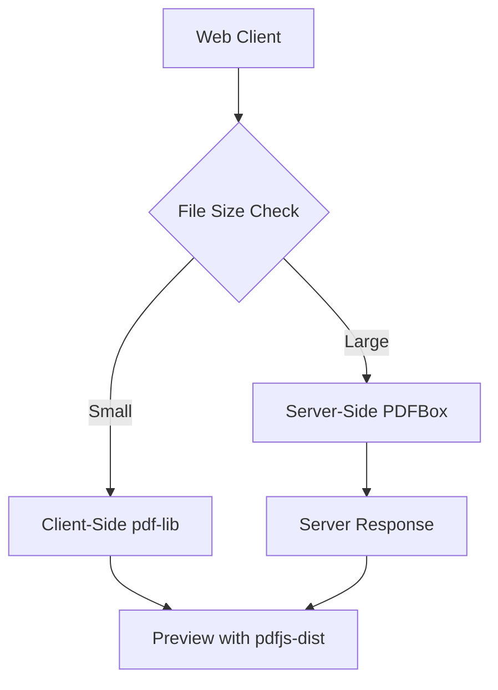
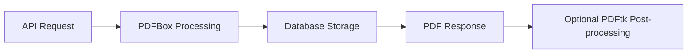

# PDF-Filler Tool Implementation Guide

## Quick Start: Recommended Tech Stack

Based on comprehensive library analysis, here's your optimal implementation path:

### Phase 1: Client-Side Foundation (Week 1-2)
```javascript
// Install dependencies
npm install pdf-lib pdfjs-dist

// Basic form filling implementation
import { PDFDocument, PDFForm } from 'pdf-lib';
import * as pdfjsLib from 'pdfjs-dist';
```

### Phase 2: Server Enhancement (Week 3-4)
```xml
<!-- Maven dependency for Java backend -->
<dependency>
    <groupId>org.apache.pdfbox</groupId>
    <artifactId>pdfbox</artifactId>
    <version>3.0.4</version>
</dependency>
```

### Phase 3: Advanced Processing (Week 5+)
```bash
# PDFtk installation for complex operations
sudo apt-get install pdftk-java  # Modern Java version
```

## Code Examples by Use Case

### 1. Client-Side Form Filling (pdf-lib)

```javascript
// Load and fill PDF form
async function fillPDFForm(pdfBytes, formData) {
    const pdfDoc = await PDFDocument.load(pdfBytes);
    const form = pdfDoc.getForm();
    
    // Fill text fields
    const nameField = form.getTextField('name');
    nameField.setText(formData.name);
    
    // Fill checkboxes
    const agreeField = form.getCheckBox('agree');
    if (formData.agree) agreeField.check();
    
    // Fill dropdown
    const countryField = form.getDropdown('country');
    countryField.select(formData.country);
    
    return await pdfDoc.save();
}

// Usage example
const filledPdf = await fillPDFForm(originalPdfBytes, {
    name: 'John Doe',
    agree: true,
    country: 'United States'
});
```

### 2. PDF Preview and Rendering (pdfjs-dist)

```javascript
// Render PDF page for preview
async function renderPDFPage(pdfBytes, pageNum = 1) {
    const loadingTask = pdfjsLib.getDocument(pdfBytes);
    const pdf = await loadingTask.promise;
    const page = await pdf.getPage(pageNum);
    
    const scale = 1.5;
    const viewport = page.getViewport({ scale });
    
    const canvas = document.getElementById('pdf-canvas');
    const context = canvas.getContext('2d');
    canvas.height = viewport.height;
    canvas.width = viewport.width;
    
    await page.render({
        canvasContext: context,
        viewport: viewport
    }).promise;
}

// Extract form field information
async function extractFormFields(pdfBytes) {
    const loadingTask = pdfjsLib.getDocument(pdfBytes);
    const pdf = await loadingTask.promise;
    const page = await pdf.getPage(1);
    
    const annotations = await page.getAnnotations();
    return annotations.filter(ann => ann.fieldType);
}
```

### 3. Server-Side Processing (Apache PDFBox)

```java
// Java implementation for enterprise form filling
import org.apache.pdfbox.pdmodel.PDDocument;
import org.apache.pdfbox.pdmodel.interactive.form.*;

public class PDFFormFiller {
    
    public byte[] fillForm(byte[] pdfBytes, Map<String, String> formData) 
            throws IOException {
        
        try (PDDocument document = PDDocument.load(pdfBytes)) {
            PDAcroForm acroForm = document.getDocumentCatalog().getAcroForm();
            
            if (acroForm != null) {
                for (Map.Entry<String, String> entry : formData.entrySet()) {
                    PDField field = acroForm.getField(entry.getKey());
                    
                    if (field instanceof PDTextField) {
                        field.setValue(entry.getValue());
                    } else if (field instanceof PDCheckBox) {
                        PDCheckBox checkbox = (PDCheckBox) field;
                        checkbox.check();
                    }
                }
                
                // Flatten form to prevent further editing
                acroForm.flatten();
            }
            
            ByteArrayOutputStream output = new ByteArrayOutputStream();
            document.save(output);
            return output.toByteArray();
        }
    }
}
```

### 4. Command-Line Batch Processing (PDFtk)

```bash
#!/bin/bash
# Batch form filling script

# Generate FDF from JSON data
function jsonToFdf() {
    local json_file=$1
    local fdf_file=$2
    
    # Convert JSON to FDF format (simplified example)
    echo "%FDF-1.2" > $fdf_file
    echo "1 0 obj" >> $fdf_file
    echo "<<" >> $fdf_file
    echo "/FDF << /Fields [" >> $fdf_file
    
    # Parse JSON and create FDF fields
    jq -r 'to_entries[] | "<< /T (\(.key)) /V (\(.value)) >>"' $json_file >> $fdf_file
    
    echo "] >>" >> $fdf_file
    echo ">>" >> $fdf_file
    echo "endobj" >> $fdf_file
    echo "trailer" >> $fdf_file
    echo "<<" >> $fdf_file
    echo "/Root 1 0 R" >> $fdf_file
    echo ">>" >> $fdf_file
    echo "%%EOF" >> $fdf_file
}

# Fill form using PDFtk
function fillFormWithPDFtk() {
    local template_pdf=$1
    local data_json=$2
    local output_pdf=$3
    
    local temp_fdf=$(mktemp --suffix=.fdf)
    jsonToFdf $data_json $temp_fdf
    
    pdftk $template_pdf fill_form $temp_fdf output $output_pdf
    rm $temp_fdf
}

# Usage
fillFormWithPDFtk "template.pdf" "data.json" "filled.pdf"
```

## Architecture Patterns

### Pattern 1: Pure Client-Side (Small Scale)


**Pros**: No server costs, instant processing, privacy
**Cons**: Limited by browser capabilities, large file handling

### Pattern 2: Hybrid Architecture (Recommended)


**Pros**: Optimal performance, scalable, fallback options
**Cons**: More complex implementation

### Pattern 3: Enterprise Server-Only


**Pros**: Maximum control, high performance, security
**Cons**: Server resources, latency

## Performance Optimization Strategies

### 1. Client-Side Optimization
```javascript
// Lazy load large libraries
const loadPdfLib = () => import('pdf-lib');
const loadPdfjs = () => import('pdfjs-dist');

// Memory management for large files
function processLargePDF(pdfBytes) {
    if (pdfBytes.length > 10 * 1024 * 1024) { // 10MB threshold
        return processOnServer(pdfBytes);
    }
    return processOnClient(pdfBytes);
}

// Worker threads for non-blocking processing
function fillFormInWorker(pdfBytes, formData) {
    return new Promise((resolve, reject) => {
        const worker = new Worker('/pdf-worker.js');
        worker.postMessage({ pdfBytes, formData });
        worker.onmessage = (e) => resolve(e.data);
        worker.onerror = reject;
    });
}
```

### 2. Server-Side Optimization
```java
// Connection pooling and caching
@Service
public class OptimizedPDFService {
    
    @Cacheable("pdf-templates")
    public PDDocument loadTemplate(String templateId) {
        // Cache frequently used templates
        return PDDocument.load(templateBytes);
    }
    
    @Async
    public CompletableFuture<byte[]> processAsync(byte[] pdfBytes, Map<String, String> data) {
        // Async processing for large batches
        return CompletableFuture.supplyAsync(() -> fillForm(pdfBytes, data));
    }
}
```

## Error Handling and Validation

### Client-Side Validation
```javascript
// Form field validation before processing
function validateFormData(formData, pdfFields) {
    const errors = [];
    
    for (const [fieldName, value] of Object.entries(formData)) {
        const field = pdfFields.find(f => f.name === fieldName);
        
        if (!field) {
            errors.push(`Field "${fieldName}" not found in PDF`);
            continue;
        }
        
        // Type validation
        if (field.type === 'number' && isNaN(value)) {
            errors.push(`Field "${fieldName}" must be a number`);
        }
        
        // Length validation
        if (field.maxLength && value.length > field.maxLength) {
            errors.push(`Field "${fieldName}" exceeds maximum length`);
        }
    }
    
    return errors;
}
```

### Server-Side Error Recovery
```java
// Robust error handling with fallbacks
public class ResilientPDFProcessor {
    
    public byte[] processWithFallback(byte[] pdfBytes, Map<String, String> formData) {
        try {
            return processPrimaryMethod(pdfBytes, formData);
        } catch (PDFProcessingException e) {
            logger.warn("Primary processing failed, trying alternative", e);
            try {
                return processAlternativeMethod(pdfBytes, formData);
            } catch (Exception fallbackError) {
                logger.error("All processing methods failed", fallbackError);
                throw new PDFProcessingException("Unable to process PDF", fallbackError);
            }
        }
    }
}
```

## Security Considerations

### Input Validation
```javascript
// Validate PDF before processing
async function validatePDF(pdfBytes) {
    try {
        const pdfDoc = await PDFDocument.load(pdfBytes);
        
        // Check for suspicious content
        const pageCount = pdfDoc.getPageCount();
        if (pageCount > 1000) {
            throw new Error('PDF too large');
        }
        
        // Validate PDF structure
        const form = pdfDoc.getForm();
        return { valid: true, fieldCount: form.getFields().length };
        
    } catch (error) {
        return { valid: false, error: error.message };
    }
}
```

### Server-Side Security
```java
// Secure PDF processing
@Component
public class SecurePDFProcessor {
    
    private static final long MAX_FILE_SIZE = 50 * 1024 * 1024; // 50MB
    private static final Set<String> ALLOWED_MIME_TYPES = Set.of("application/pdf");
    
    public void validateUpload(MultipartFile file) {
        if (file.getSize() > MAX_FILE_SIZE) {
            throw new ValidationException("File too large");
        }
        
        if (!ALLOWED_MIME_TYPES.contains(file.getContentType())) {
            throw new ValidationException("Invalid file type");
        }
        
        // Additional security checks
        scanForMaliciousContent(file);
    }
}
```

## Deployment Recommendations

### Development Setup
```bash
# Frontend dependencies
npm install pdf-lib pdfjs-dist

# Backend dependencies (Maven)
mvn install org.apache.pdfbox:pdfbox:3.0.4

# System dependencies
sudo apt-get install pdftk-java
```

### Production Deployment
```yaml
# Docker configuration
version: '3.8'
services:
  pdf-filler-frontend:
    build: ./frontend
    ports:
      - "3000:3000"
    environment:
      - REACT_APP_API_URL=http://pdf-filler-backend:8080
      
  pdf-filler-backend:
    build: ./backend
    ports:
      - "8080:8080"
    environment:
      - JAVA_OPTS=-Xmx2g -XX:+UseG1GC
    volumes:
      - ./tmp:/app/tmp
```

This implementation guide provides a complete roadmap for building a robust, scalable PDF-filler tool using the optimal library combinations identified in the research phase.